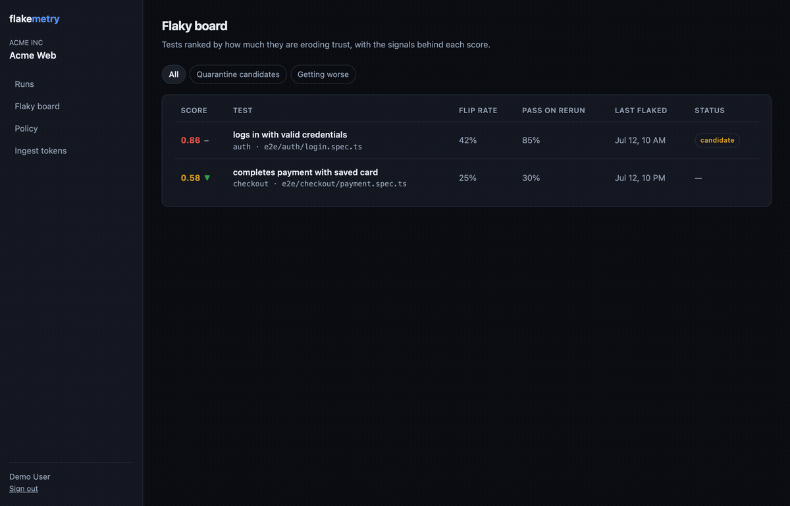

<div align="center">

# Flakemetry

### OpenTelemetry-native test intelligence platform

**Treat every test run as a trace, not a report.**

Test observability · explainable flaky-test detection · AI-assisted root-cause analysis

[](./LICENSE)
[](https://www.typescriptlang.org/)
[](https://opentelemetry.io/)
[](https://github.com/AKogut/flakemetry/issues)
[](https://github.com/users/AKogut/projects/14)

[Docs](https://akogut.github.io/flakemetry/) · [Wiki](https://github.com/AKogut/flakemetry/wiki) · [Architecture](https://github.com/AKogut/flakemetry/wiki/Architecture) · [Roadmap](https://github.com/AKogut/flakemetry/wiki/Roadmap) · [Discussions](https://github.com/AKogut/flakemetry/discussions)

</div>

> **Status: early development, built in the open.** Foundations are landing milestone by milestone (M0 → M6). Follow the [public roadmap board](https://github.com/users/AKogut/projects/14).

---

## Why Flakemetry

Test tooling is stuck. Three systemic gaps:

- **Tests are report artifacts, not telemetry.** JUnit XML and HTML reports capture *one* run — no history, no trace context, no correlation with application signals.
- **Flaky detection is primitive.** Most teams "detect" flakes by eyeballing `retries > 0`. No stable identity across refactors, no statistical model, no auto-quarantine.
- **Root-cause is manual archaeology.** Every failure means digging through logs, stack traces, screenshots, and git blame — 20–40 minutes an incident.

Test reporters answer *"what happened in this run?"* **Flakemetry answers *"is this test trustworthy, why is it failing, and is it getting worse?"*** — across every run, branch, and refactor.

## The idea: tests as traces

If every test execution is modelled as an **OpenTelemetry span**, then historical analytics, flaky scoring, and AI root-cause become natural extensions of the telemetry instead of bolted-on hacks. That single decision is the platform's technical moat.

## What it does

| Capability | What you get |
|---|---|
| **Test observability** | Every run ingested as OTLP; full history per test, not per report |
| **Stable test identity** | Fingerprints that survive file moves, renames, and parameterization |
| **Explainable flaky scoring** | A transparent Bayesian score with human-readable reason codes — not a black box |
| **AI root-cause analysis** | Structured "likely cause + suggested action", budget-gated, provider-agnostic (Claude or local Ollama) |
| **CI-native** | GitHub Action + sticky PR comment; never blocks your build |
| **Self-hostable** | One `docker compose up`, MIT-licensed core |

## Architecture

```
 reporter / OTLP / GitHub Action
              │  OTLP-HTTP (JSON), idempotency-key
              ▼
   Ingestion API (Fastify) ── validate + enqueue ─▶ 202 (never blocks CI)
              │
              ▼   durable queue (Postgres SKIP LOCKED)
   Workers ── normalize ▶ test identity ▶ flaky scoring ▶ signature clustering ▶ AI RCA
              │
              ▼
   PostgreSQL (relational + JSONB + pgvector) · Object store (S3/MinIO)
              │
              ▼
   Query API (tRPC/REST) ─▶ Next.js dashboard  (runs · test history · flaky board · RCA)
```

The write path returns `202` instantly and does the heavy work asynchronously — **ingestion never blocks CI**. Full design in the [Architecture wiki](https://github.com/AKogut/flakemetry/wiki/Architecture).

## Quickstart

```bash
git clone https://github.com/AKogut/flakemetry.git
cd flakemetry
cp .env.example .env
echo "AUTH_SECRET=$(openssl rand -base64 32)" >> .env
docker compose up
```

The dashboard is on [localhost:3000](http://localhost:3000) and the ingestion API on
[localhost:4000](http://localhost:4000), seeded with demo runs. Sign-in uses GitHub OAuth — create
an OAuth app with callback `http://localhost:3000/api/auth/callback/github` and put its
`AUTH_GITHUB_ID` / `AUTH_GITHUB_SECRET` in `.env`. The first account to sign in adopts the seeded
workspace.

For a horizontally scaled hosted environment, [`deploy/`](deploy) ships a Helm chart
(stateless `api`/`worker`/`web` with autoscaling, a migration hook, and ingress) plus an
operations [runbook](deploy/RUNBOOK.md) with SLOs — see the [deploy guide](deploy/README.md).

## See it in 60 seconds

Load the demo dataset — one project's worth of history with a stable test, two flaky tests, and a
regression that AI RCA explains:

```bash
pnpm demo   # resets the database and seeds the demo dataset in one command
```

Then walk the story in the dashboard:

1. **Flaky board** — every test ranked by a transparent score, worst first.
2. **Test detail** — that score broken into reason codes (same commit, different result · pass-on-rerun · …).
3. **RCA panel** — the `orders` regression, explained with a likely cause and a suggested fix.

Prefer to generate the data yourself? Run the sample suite in
[`examples/playwright-demo`](examples/playwright-demo) against your instance a few times — it ships one
of every outcome (stable, timing-race flake, retry flake, regression).



<sub>Recorded from the walkthrough above · re-capture it with [docs/recording-the-demo.md](docs/recording-the-demo.md).</sub>

Add the reporter to a Playwright project:

```ts
import { defineConfig } from '@playwright/test'

export default defineConfig({
  reporter: [['@flakemetry/playwright-reporter']],
})
```

Vitest works the same way — the reporters share one OpenTelemetry model, so runs land with the same identity and flaky scoring:

```ts
import { defineConfig } from 'vitest/config'

export default defineConfig({
  test: {
    reporters: ['default', '@flakemetry/vitest-reporter'],
  },
})
```

Jest too — add it to `reporters` in your Jest config:

```js
export default {
  reporters: ['default', '@flakemetry/jest-reporter'],
}
```

Python? Install the pytest plugin — it registers itself, and with `pytest-rerunfailures` a test that passes on rerun is reported as flaky:

```bash
pip install pytest-flakemetry
pytest --reruns 2
```

No native reporter? Any runner that writes **JUnit XML** — pytest, Go, Ruby, JUnit, PHPUnit — maps onto the same conventions through the CLI, so a JUnit upload yields the same intelligence as the native reporters:

```bash
pytest --junitxml=junit.xml
npx flakemetry junit junit.xml
```

Wire it into CI. Let the test step write the results file, then upload it — the upload
step runs even when tests fail and never blocks the build:

```yaml
- name: Run tests
  run: npx playwright test
  env:
    FLAKEMETRY_OUTPUT_FILE: flakemetry-results.json

- name: Upload to Flakemetry
  if: always()
  uses: AKogut/flakemetry/.github/actions/flakemetry@main
  with:
    token: ${{ secrets.FLAKEMETRY_TOKEN }}
    endpoint: ${{ secrets.FLAKEMETRY_ENDPOINT }}

- name: Comment flaky summary on the PR
  if: always()
  uses: AKogut/flakemetry/.github/actions/flakemetry-pr-comment@main
  with:
    token: ${{ secrets.FLAKEMETRY_TOKEN }}
    endpoint: ${{ secrets.FLAKEMETRY_ENDPOINT }}

- name: Quality gate — block only new failures
  if: always()
  uses: AKogut/flakemetry/.github/actions/flakemetry-gate@main
  with:
    token: ${{ secrets.FLAKEMETRY_TOKEN }}
    endpoint: ${{ secrets.FLAKEMETRY_ENDPOINT }}
    strictness: new
```

The comment step needs `permissions: pull-requests: write` on the job. It posts one sticky
comment and updates it on every run; it never fails the build.

The gate step compares the PR run against the base branch and distinguishes *new* failures
this change introduced from tests that already flake on the base. It posts a sticky verdict
comment, sets a `flakemetry/gate` commit status, and fails the step only on new failures
(`strictness: new`) — flip to `any` to block known flakes too, or `off` for report-only. It
needs `permissions: pull-requests: write` and `statuses: write`.

It also emits per-test workflow annotations that show inline in the PR: an error on each new
failure, and a non-blocking warning on each known flake — or a distinct notice reading
`test X is quarantined (flaky score 0.86) — not blocking this build` for auto-quarantined tests,
so a quarantined flaky test visibly stops failing the build with a clear trail.

Prefer sending straight from your own tooling? `flakemetry upload flakemetry-results.json`
(from `@flakemetry/cli`) does the same over any CI provider, reading
`FLAKEMETRY_ENDPOINT` and `FLAKEMETRY_TOKEN` from the environment.

## How it works

- **[Test Identity Engine](https://github.com/AKogut/flakemetry/wiki/Test-Identity-Engine)** — a multi-level fingerprint (exact → moved → renamed → parameterized) that stitches history across refactors, so a flaky test doesn't reset to zero when a file moves.
- **[Flaky Scoring](https://github.com/AKogut/flakemetry/wiki/Flaky-Scoring)** — a Beta-Binomial model with exponential time-decay. The strongest signal is *same commit, different result*. Every score ships with reason codes explaining it.
- **[AI RCA](https://github.com/AKogut/flakemetry/wiki/AI-RCA-Architecture)** — failures are normalized and clustered cheaply; only genuinely new signatures reach an LLM, budget-gated and cached per cluster.
- **[OTel Test Conventions](https://github.com/AKogut/flakemetry/wiki/OTel-Test-Conventions)** — the span and attribute model every reporter emits to.

## Monorepo layout

```
apps/
  web/            Next.js dashboard
  api/            Fastify ingestion + tRPC query
  worker/         processing (identity, scoring, clustering, RCA)
  docs/           VitePress documentation site
packages/
  contracts/      zod schemas + shared types (single source of truth)
  db/             Prisma schema + migrations
  core/           pure domain logic (identity, flaky scoring)
  reporter/       @flakemetry/playwright-reporter
  sdk/            OTel instrumentation + ingest client
  ai/             LLMProvider abstraction + RCA
  cli/            @flakemetry/cli
  pytest-flakemetry/  pytest plugin (Python)
```

Built with pnpm workspaces + Turborepo. Rationale in [ADR-0001](https://github.com/AKogut/flakemetry/wiki/Architecture).

## Roadmap

| Milestone | Focus |
|---|---|
| **M0** | Foundation & DevEx — monorepo, contracts, schema, CI, one-command local dev |
| **M1** | MVP — OTel-native ingestion, test identity, explainable flaky scoring, AI RCA, dashboard, GitHub Action |
| **M2** | Deep observability & test intelligence — full traces, artifacts, waterfall, suite health, signature clustering, auto-quarantine, PR quality gate, notifications, code ownership |
| **M3** | Known-issue detection, cross-run correlation, deeper root-cause analysis |
| **M4** | Platform — multi-framework reporters, plugins, public API |
| **M5** | SaaS & scale — multi-tenant, RBAC/SSO, columnar span store |
| **M6** | Community, docs & launch |

Tracked issue-by-issue on the [roadmap board](https://github.com/users/AKogut/projects/14).

## Documentation

The [**documentation site**](https://akogut.github.io/flakemetry/) is the canonical guide — getting started, self-hosting, reporter and CLI setup, and the concepts behind test identity, flaky scoring, and AI RCA. It is built from [`apps/docs`](apps/docs) and deployed to GitHub Pages on every change.

Deeper product and design context — vision, data model, scaling, and the OSS/monetization model — lives in the [**Wiki**](https://github.com/AKogut/flakemetry/wiki).

## Contributing

Trunk-based development, short-lived branches, squash-merged PRs. See the [Branching & Git Workflow](https://github.com/AKogut/flakemetry/wiki/Branching-and-Git-Workflow) guide. Good first issues are labelled in the [issue tracker](https://github.com/AKogut/flakemetry/issues).

## Tech stack

TypeScript · Playwright · Node.js · PostgreSQL (Prisma) · React / Next.js · Docker · GitHub Actions · OpenTelemetry

## License

[MIT](./LICENSE) © Andrii Kohut
